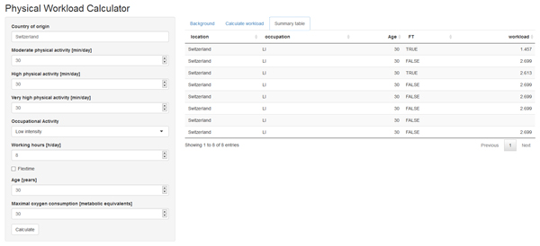

## Synopsis

- Serious injury or illness can lead to a significant loss of working hours and substantial health care costs
- Physical workload was found to be an independent risk factor for disability retirement 
- Employers and insurance agencies may have to assess the work capacity of a person to adequately adjust the job profile

---

## What the app does

The [Physical Workload Calculator](https://masswear.shinyapps.io/workload_calculator) uses various personal- and job-related factors for evaluating workload:

- Physical activity: the oxygen consumption of the body per kilogram per minute during any given activity (in metabolic equivalents, METs). One MET corresponds to 3.5 ml O<sub>2</sub>/kg/min.
- Occupational activity: the general intensity of an occupation
- Maximal oxygen consumption: the aerobic physical fitness of the individual
- working hours per day
- flextime (yes/no)
- age

Each entry is recorded in a google spreadsheet

---

## How the App works

Workload is calculated using a linear regression equation that was derived from a sample of 303 healthy adults in Switzerland. Because the work has not been published yet, the equation cannot be shared publicly here.


```r
input <- list("MPA" = 30, "HPA" = 30, "VHPA" = 30, "occupation" = "MI", "WH" = 8.5, "FT" = TRUE,
              "Age" = 30, "VO2max" = 30)
new_workload <- calc_workload(input$MPA,
                              input$HPA,
                              input$occupation,
                              input$WH,
                              input$VHPA,
                   as.numeric(input$FT),
                              input$Age,
                              input$VO2max)
```

Workload = 2.741 METs

---

## How to use the App

1. In the left-hand sidebar panel, enter your data 
2. Click the "calculate" button
3. The app automatically changes to the "Calculate workload" tab to show the workload
4. Go to the "Summary table" tab to view the previous entries in the google sheet




